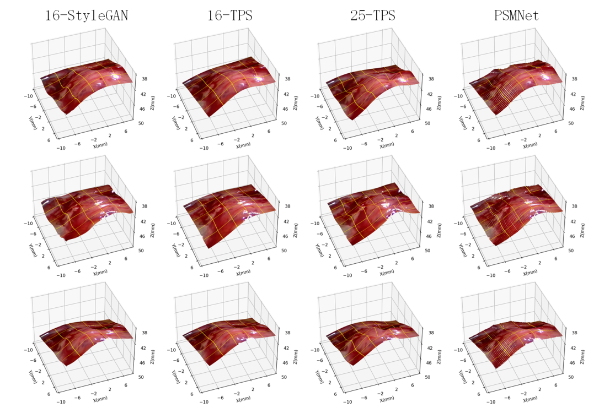

## K-TPS-StyleGAN&mdash;Tensorflow implementation



**Disparity Estimation of Stereo-endoscopic Images Using StyleGAN**

Abstract: *In minimally invasive surgeries, reconstructing dynamic soft tissues can improve surgical robot’s perception and maneuverability. A novel stereo matching pipeline for stereoendoscopic images is proposed by exploring the latent space of pre-trained disparity map generative model. First, disparity maps of past stereo-endoscopic images are estimated based on the traditional thin plate spline model. A simplified StyleGAN is then trained based on the estimated disparity maps, and the distribution of reasonable disparity maps is learned by its generator. For the forthcoming stereo image pair, the learnt generator is incorporated into a self supervised stereo matching framework as a disparity representation model, and its latent vector is trained to embed an optimal disparity map that minimizes the photometric loss between the stereo image pair. The performance of the proposed pipeline is finally verified on stereo-endoscopic videos recorded by the da Vinci robots*

## Environment requirements

This repo is inspired by an amazing work of Tero Karras and Janne Hellsten for generator architecture, [StyleGAN](https://github.com/NVlabs/stylegan).

For consistence, we followed the system requirements at [StyleGAN](https://github.com/NVlabs/stylegan).

## Preparing datasets

Datasets for training StyleGAN part is followed by the requirements of StyleGAN official. You can unzip `MNdatasets.rar` and put .tfrecords files under 'MNdatasets' folder. Other dataset for our model training has been upload to `datasets` folder.

## Training
- Step 1
Set up training parameters and run `train.py` for training simplied StyleGAN. You can find more setting details at [StyleGAN](https://github.com/NVlabs/stylegan) 
- Step 2
Set up path of `.pkl` file, which saved at `results\{}-sgan-{datasets_name}-xgpu\` folder and other training strategy at `k-styleGAN.py` or `k-styleGAN_per.py`. Then just run it.

## Application
Modify training parameter `data_size` to 1 and modify range of load images to implement model.

Difference between `k-styleGAN.py` or `k-styleGAN_per.py` is using last output disparity or not for current training.


## Citation

```
@inproceedings{,
  title     = {Disparity Estimation of Stereo-endoscopic Images Using StyleGAN},
  author    = {},
  booktitle = {},
  year      = {2022}
}
```
## Acknowledgement
Our code is based on the implementation of StyleGAN. Thanks for its authors' excellent work and repository.
